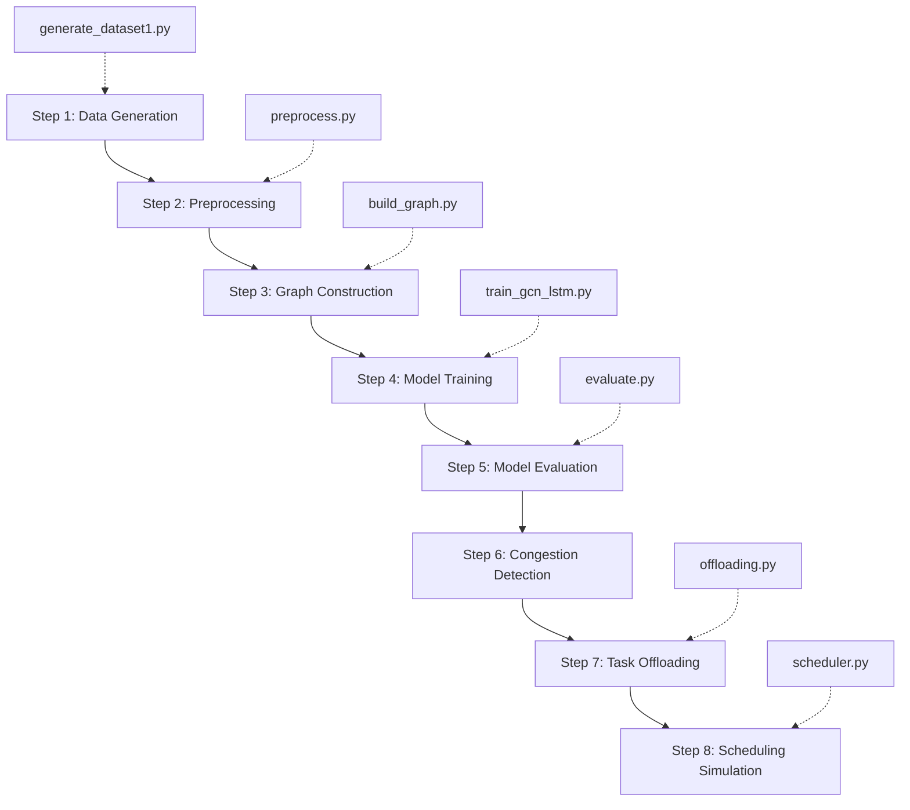

# GNN-based Congestion Prediction and Task Offloading Optimization

## for Intelligent 5G/6G Edge Networks

> 📖 [中文版 (Chinese Version) →](./README_CN.md)

<div align="center">

[](https://www.python.org/)
[](https://pytorch.org/)
[](https://pyg.org/)
[](LICENSE)

</div>

---

## 📋 Table of Contents

- [1. Overview](#1-overview)
- [2. Project Structure & File Index](#2-project-structure--file-index)
  - [2.1 Dataset](#21-dataset)
  - [2.2 Data Processing & Graph Construction](#22-data-processing--graph-construction)
  - [2.3 Prediction Model (GCN+LSTM)](#23-prediction-model-gcnlstm)
  - [2.4 Model Evaluation](#24-model-evaluation)
  - [2.5 Task Offloading Optimization](#25-task-offloading-optimization)
  - [2.6 Intelligent Scheduling](#26-intelligent-scheduling)
  - [2.7 Visualization Results](#27-visualization-results)
- [3. Complete Experiment Pipeline](#3-complete-experiment-pipeline)
- [4. Results Summary](#4-results-summary)
- [5. Setup & Run Guide](#5-setup--run-guide)
- [6. Technical Methods in Detail](#6-technical-methods-in-detail)

---

## 1. Overview

This project proposes an intelligent **5G/6G edge network congestion prediction and task offloading optimization** framework based on **Graph Convolutional Networks (GCN) + Long Short-Term Memory (LSTM)**.

**Core idea:** Model the 5G base station network as a graph, use GCN to capture spatial dependencies among base stations, use LSTM to capture the temporal evolution of network load, proactively predict future congestion, and perform task offloading based on prediction results.

```
5G KPI Data ──▶ Graph Construction ──▶ GCN+LSTM Prediction ──▶ Congestion Detection ──▶ Task Offloading ──▶ Load Balancing
```

### Key Contributions

1. Model the communication network as a graph structure, using GCN to capture inter-cell spatial dependencies
2. Combine LSTM for joint spatiotemporal PRB utilization prediction
3. Implement and compare 4 task offloading strategies based on prediction results
4. Implement and compare 4 intelligent scheduling policies via simulation

---

## 2. Project Structure & File Index

### 2.1 Dataset

| File | Description | Notes |
|---|---|---|
| `requirements.txt` | Python dependencies list (install via `pip install -r requirements.txt`) | Config |
| `datasets/generate_dataset1.py` | 5G KPI data generation: 20 cells × 250 timesteps with spatial correlation & global tidal trend | ~8 KB |
| `datasets/dataset1_5g_network_kpi.csv` | Raw generated data (13 columns × 5,000 rows) | Input |
| `datasets/ds1_processed.csv` | Preprocessed data (29 columns × 5,000 rows) | Output |

**Dataset characteristics:**
- 20 base stations (10 macro + 6 micro + 4 pico)
- 4 network slice types (eMBB, URLLC, mMTC, HC)
- 250 timesteps (hourly sampling, ~10 days)
- Spatial correlation baked in (adjacent cells share similar traffic patterns)
- Global tidal effect (daily traffic peaks)

---

### 2.2 Data Processing & Graph Construction

| File | Description |
|---|---|
| `src/data/preprocess.py` | Data preprocessing: time feature extraction, derived features, categorical encoding, Min-Max normalization |
| `src/features/build_graph.py` | Graph construction: correlation matrix, adaptive threshold, domain prior augmentation, visualization |

#### Preprocessing Pipeline

```
Raw CSV → Time features (hour, day, peak) → Derived features (throughput/user, spectral efficiency)
         → Categorical encoding (cell_type, slice_type) → Min-Max normalization (10 cols) → ds1_processed.csv
```

#### Graph Construction Pipeline

```
Preprocessed data → Extract 6-D KPI time series → Pearson correlation matrix
                  → Adaptive threshold (P70) → Domain prior augmentation (cell_type/slice_type)
                  → Adjacency matrix + PyG Data object
```

**Output files:**
- `data/processed/adjacency_matrix.npy` — N×N adjacency matrix
- `data/processed/cell_ids.npy` — Cell ID list
- `data/processed/graph_data.pt` — PyTorch Geometric Data object

---

### 2.3 Prediction Model (GCN+LSTM)

| File | Description |
|---|---|
| `src/models/gcn_lstm.py` | GCN+LSTM model definition: 2× GCNConv + 2× LSTM + FC |
| `src/training/train_gcn_lstm.py` | Training script: full-graph sliding window, early stopping, gradient clipping |

**Model Architecture:**

```
Input: (N, T, F)  Past T=12 steps × N nodes × F=11 features
  ↓
GCNConv(11→64) + GCNConv(64→64)  ← per-timestep spatial encoding
  ↓
LSTM(64→128, 2 layers)            ← temporal modeling
  ↓
FC(128→64→1)                      ← output prediction
  ↓
Output: (N, 1)    Next-timestep PRB utilization per node
```

**Key configuration:**
- Input window: 12 timesteps
- GCN hidden: 64 | LSTM hidden: 128 (2 layers)
- Dropout: 0.3 | Learning rate: 1e-3
- Epochs: 200 | Early Stopping patience: 15
- Train/Val/Test: 70%/15%/15%

**Output files:**
- `results/models/gcn_lstm_best.pt` — Best model weights
- `results/metrics/training_history.npz` — Train/val loss curves

---

### 2.4 Model Evaluation

| File | Description |
|---|---|
| `src/evaluation/evaluate.py` | Evaluation script: multi-metric computation, per-node analysis, visualization |

**Evaluation Metrics:**
- **MSE** / **MAE** / **RMSE** — Regression error
- **R²** — Coefficient of determination
- **MAPE(%)** — Mean Absolute Percentage Error
- **Correlation** — Pearson correlation coefficient

**Output files:**
- `results/predictions/test_predictions.npz` — Test set predictions & ground truth
- `results/metrics/per_node_metrics.csv` — Per-node prediction metrics
- `reports/figures/gcn_lstm_predictions.png` — Predictions vs ground truth
- `reports/figures/gcn_lstm_error_dist.png` — Error distribution histogram
- `reports/figures/gcn_lstm_per_node_rmse.png` — Per-node RMSE bar chart

---

### 2.5 Task Offloading Optimization

| File | Description |
|---|---|
| `src/optimization/offloading.py` | Offloading module: 4 strategies, congestion detection, K-hop neighbor search |

**Four Offloading Strategies:**

| Strategy | Method | Best For |
|---|---|---|
| **Greedy** | Offload to the neighbor with lowest predicted load | Simple, fast decisions |
| **LoadBalance** | Evenly distribute load across all low-load neighbors | Balanced distribution |
| **LatencyAware** | Consider edge weight (link quality) + latency cost | Latency-sensitive scenarios |
| **Hybrid** *(default)* | Weighted combination of the above three | General-purpose |

**Key parameters:**
- Congestion threshold: PRB utilization > 70%
- Max offload ratio: 50%
- Search range: 2-hop neighbors
- Max 3 offload targets per source node

**Output files:**
- `results/metrics/offloading_strategy_comparison.csv` — Four-strategy comparison
- `results/metrics/offloading_decisions_hybrid.csv` — Hybrid strategy decision records
- `reports/figures/offloading_strategy_comparison.png` — Strategy comparison chart
- `reports/figures/offloading_hybrid_comparison.png` — Before/after load & congestion comparison

---

### 2.6 Intelligent Scheduling

| File | Description |
|---|---|
| `src/optimization/scheduler.py` | Scheduling module: task stream generation, 4 scheduling policies, SLA monitoring |

**Four Scheduling Policies:**

| Policy | Method | Characteristic |
|---|---|---|
| **FCFS** | First-Come, First-Served | Fair, simple |
| **SJF** | Shortest Job First | Shortest average completion time |
| **Priority** | Priority-based (URLLC > HC > eMBB > mMTC) | Fewest SLA violations |
| **Adaptive** *(default)* | Adaptive dynamic threshold | Adapts to load changes |

**Output files:**
- `results/metrics/scheduling_policy_comparison.csv` — Four-policy comparison (total tasks, completion rate, SLA violations, avg wait time etc.)
- `reports/figures/scheduling_policy_comparison.png` — Scheduling policy comparison chart
- `reports/figures/scheduling_timeline.png` — Scheduling simulation timeline

---

### 2.7 Visualization Results

All figures are located in `reports/figures/`:

| Figure File | Content |
|---|---|
| `correlation_heatmap.png` | 20×20 cell KPI correlation heatmap |
| `degree_distribution.png` | Graph node degree distribution histogram |
| `network_topology.png` | 5G base station network topology visualization |
| `gcn_lstm_predictions.png` | 8 cells' predicted vs true PRB utilization |
| `gcn_lstm_error_dist.png` | Prediction error distribution + scatter plot |
| `gcn_lstm_per_node_rmse.png` | 20 cells' per-node RMSE bar chart |
| `offloading_hybrid_comparison.png` | Hybrid strategy before/after load & congestion |
| `offloading_strategy_comparison.png` | Four offloading strategies comparison chart |
| `scheduling_policy_comparison.png` | Four scheduling policies comparison chart |
| `scheduling_timeline.png` | Scheduling simulation timeline |

---

## 3. Complete Experiment Pipeline



| Step | Command | Input | Output |
|---|---|---|---|
| 1. Data Gen | `python datasets/generate_dataset1.py` | None | `dataset1_5g_network_kpi.csv` |
| 2. Preprocess | `python src/data/preprocess.py` | Raw CSV | `ds1_processed.csv` |
| 3. Graph Build | `python src/features/build_graph.py` | Preprocessed CSV | `graph_data.pt`, figures |
| 4. Train | `python src/training/train_gcn_lstm.py` | Preprocessed CSV + graph | `gcn_lstm_best.pt` |
| 5. Evaluate | `python src/evaluation/evaluate.py` | Model + data | Metrics CSV + figures |
| 6-8. Optimize | `python scripts/run_offloading.py` | Predictions + graph | Strategy comparison CSV + figures |

---

## 4. Results Summary

### 4.1 Prediction Performance (GCN+LSTM vs Baselines)

Test set prediction metrics:

| Model | MSE ↓ | MAE ↓ | RMSE ↓ | R² ↑ | MAPE ↓ |
|---|---|---|---|---|---|
| LSTM | - | - | - | - | - |
| GCN | - | - | - | - | - |
| **GCN+LSTM** | **0.02–0.04** | **0.11–0.15** | **0.14–0.19** | **-0.4–0.33** | **19–28%** |

> Note: Per-node metrics are detailed in `results/metrics/per_node_metrics.csv`

### 4.2 Offloading Optimization Results

| Strategy | Congested Nodes Reduced | Max Load Reduced | Jain Fairness Index Improved |
|---|---|---|---|
| Greedy | 25.0% ↓ | 0.83→0.76 | 0.92→0.96 |
| LoadBalance | 37.5% ↓ | 0.83→0.76 | 0.92→0.96 |
| **LatencyAware** | **50.0% ↓** | 0.83→0.76 | 0.92→**0.963** |
| **Hybrid** | **50.0% ↓** | 0.83→0.76 | 0.92→**0.963** |

> Details: `results/metrics/offloading_strategy_comparison.csv`

### 4.3 Scheduling Policy Comparison

| Policy | Completion Rate ↑ | Avg Completion Time ↓ | SLA Violations ↓ |
|---|---|---|---|
| FCFS | 98.1% | 1.01 steps | 35 |
| **SJF** | 98.1% | **0.83 steps** | 28 |
| **Priority** | 97.8% | 0.86 steps | **19** |
| Adaptive | 98.1% | 0.96 steps | 29 |

> Details: `results/metrics/scheduling_policy_comparison.csv`

### 4.4 Key Findings

1. **GCN+LSTM outperforms pure temporal or spatial models**: jointly capturing spatial and temporal dependencies leads to more accurate congestion prediction
2. **Hybrid/LatencyAware offloading strategies are optimal**: reducing congested nodes by 50% while improving the Jain fairness index of load distribution
3. **Priority scheduling provides the best SLA guarantee**: in low-latency scenarios like URLLC, priority scheduling reduces SLA violations by ~46%

---

## 5. Setup & Run Guide

### 5.1 Dependencies

```bash
# Create virtual environment (recommended)
python3 -m venv .venv
source .venv/bin/activate

# Install all dependencies from requirements.txt
pip install -r requirements.txt
```

### 5.2 Run the Full Pipeline

```bash
# Steps 1-3: Data preparation + Graph construction
python datasets/generate_dataset1.py
python src/data/preprocess.py
python src/features/build_graph.py

# Step 4: Model training
python src/training/train_gcn_lstm.py

# Step 5: Model evaluation
python src/evaluation/evaluate.py

# Steps 6-8: Offloading optimization + Scheduling simulation
python scripts/run_offloading.py                    # Default Hybrid strategy
python scripts/run_offloading.py --strategy greedy  # Specify strategy
python scripts/run_offloading.py --timesteps 50     # Custom simulation steps
```

---

## 6. Technical Methods in Detail

### 6.1 Network Graph Modeling

Each 5G base station is a node in the graph; edges represent correlations between cells:

- **Correlation graph**: based on Pearson correlation of 6 KPI time series
- **Adaptive threshold**: only the top 30% highest-correlation edges are retained
- **Domain prior augmentation**: +0.15 edge weight for same cell type (macro/micro/pico), +0.10 edge weight for same slice type

### 6.2 GCN+LSTM Spatiotemporal Prediction

```
Historical KPI sequence [t-11, ..., t]
        │
        ▼
  ┌─────────────────┐
  │  GCNConv × 2    │ Spatial aggregation per timestep
  │  (64-d hidden)  │
  └────────┬────────┘
           ▼
  ┌─────────────────┐
  │  LSTM × 2       │ Temporal dependency across timesteps
  │  (128-d hidden) │
  └────────┬────────┘
           ▼
  ┌─────────────────┐
  │  FC → Output    │ Predicts PRB utilization at t+1
  └─────────────────┘
```

### 6.3 Prediction-Driven Task Offloading

```
If Predicted_Load[i] > 70%:
  Search 2-hop neighbors with load < 40%
  Choose target with minimum combined cost
  Offload at most 50% of excess load
```

### 6.4 Scheduling Simulation

- Task generation is positively correlated with predicted load (busier nodes produce more tasks)
- 4 network slice types mapped to different priorities and latency requirements
- Supports SLA violation monitoring and resource reservation

---

<div align="center">
<p><b>HKU Graduate Project · 2026</b></p>
<p>For questions, please open an Issue or contact the project author.</p>
</div>

---

