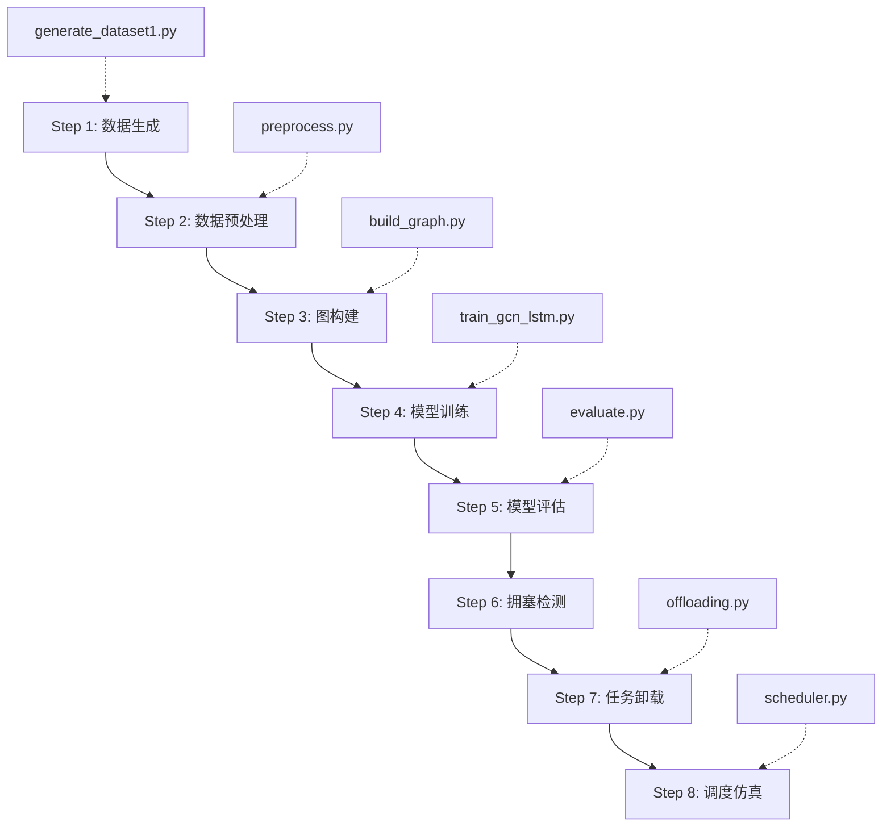

# GNN-based Congestion Prediction and Task Offloading Optimization

## 基于图神经网络的 5G/6G 边缘网络拥塞预测与任务卸载优化

> 📖 [English Version (英文版) →](./README.md)

<div align="center">

[](https://www.python.org/)
[](https://pytorch.org/)
[](https://pyg.org/)
[](LICENSE)

</div>

---

## 📋 目录

- [1. 项目简介](#1-项目简介)
- [2. 项目结构与文件索引](#2-项目结构与文件索引)
  - [2.1 数据集](#21-数据集)
  - [2.2 数据处理与图构建](#22-数据处理与图构建)
  - [2.3 预测模型（GCN+LSTM）](#23-预测模型gcnlstm)
  - [2.4 模型评估](#24-模型评估)
  - [2.5 任务卸载优化](#25-任务卸载优化)
  - [2.6 智能调度](#26-智能调度)
  - [2.7 可视化结果](#27-可视化结果)
- [3. 完整实验流程](#3-完整实验流程)
- [4. 结果汇总](#4-结果汇总)
- [5. 环境配置与运行指南](#5-环境配置与运行指南)
- [6. 技术方法详解](#6-技术方法详解)

---

## 1. 项目简介

本项目提出了一种**基于图神经网络（GCN）+ 长短期记忆网络（LSTM）**的智能 5G/6G 边缘网络拥塞预测与任务卸载优化框架。

**核心思路：** 将 5G 基站网络建模为图结构，利用 GCN 捕捉基站间的空间依赖关系，利用 LSTM 捕捉网络负载的时序演变规律，提前预测未来拥塞，并根据预测结果主动进行任务卸载调度。

```
5G KPI 数据 ──▶ 网络图构建 ──▶ GCN+LSTM 预测 ──▶ 拥塞检测 ──▶ 任务卸载优化 ──▶ 负载均衡
```

### 主要贡献

1. 将通信网络建模为图结构，使用 GCN 捕捉基站间空间依赖
2. 结合 LSTM 实现时空联合的 PRB 利用率预测
3. 基于预测结果实现 4 种任务卸载策略的对比分析
4. 实现 4 种智能调度策略的仿真对比

---

## 2. 项目结构与文件索引

### 2.1 数据集

| 文件 | 说明 | 大小 |
|---|---|---|
| `requirements.txt` | Python 依赖列表（通过 `pip install -r requirements.txt` 安装） | 配置 |
| `datasets/generate_dataset1.py` | 5G KPI 数据生成脚本：20 基站 × 250 时间步，带空间相关性与全局潮汐趋势 | ~8 KB |
| `datasets/dataset1_5g_network_kpi.csv` | 原始生成数据（13 列 × 5000 行） | 原始输入 |
| `datasets/ds1_processed.csv` | 预处理后的数据（29 列 × 5000 行） | 处理后输出 |

**数据集特性：**
- 20 个基站（10 macro + 6 micro + 4 pico）
- 4 种网络切片类型（eMBB, URLLC, mMTC, HC）
- 250 个时间步（每小时采样，约 10 天）
- 含空间相关性（相邻基站流量模式相似）
- 含全局潮汐效应（日周期流量高峰）

---

### 2.2 数据处理与图构建

| 文件 | 说明 |
|---|---|
| `src/data/preprocess.py` | 数据预处理：时间特征提取、派生特征计算、类别编码、Min-Max 归一化 |
| `src/features/build_graph.py` | 图构建：相关性矩阵计算、自适应阈值、领域先验增强、可视化 |

#### 预处理流程

```
原始 CSV → 时间特征(hour, day, peak) → 派生特征(吞吐/用户, 频谱效率)
         → 类别编码(cell_type, slice_type) → Min-Max 归一化(10列) → ds1_processed.csv
```

#### 图构建流程

```
预处理数据 → 提取 6 维 KPI 时间序列 → 皮尔逊相关系数矩阵
           → 自适应阈值(P70) → 领域先验增强(cell_type/slice_type)
           → 邻接矩阵 + PyG Data 对象
```

**输出文件：**
- `data/processed/adjacency_matrix.npy` — N×N 邻接矩阵
- `data/processed/cell_ids.npy` — 基站 ID 列表
- `data/processed/graph_data.pt` — PyTorch Geometric Data 对象

---

### 2.3 预测模型（GCN+LSTM）

| 文件 | 说明 |
|---|---|
| `src/models/gcn_lstm.py` | GCN+LSTM 模型定义：2 层 GCNConv + 2 层 LSTM + FC |
| `src/training/train_gcn_lstm.py` | 训练脚本：全图滑动窗口、早停、梯度裁剪 |

**模型架构：**

```
输入: (N, T, F)  过去 T=12 步 × N 个节点的 F=11 维特征
  ↓
GCNConv(11→64) + GCNConv(64→64)  ← 逐时间步空间编码
  ↓
LSTM(64→128, 2层)                 ← 时序建模
  ↓
FC(128→64→1)                      ← 输出预测
  ↓
输出: (N, 1)    下一时刻各节点 PRB 利用率
```

**关键配置：**
- 输入窗口: 12 个时间步
- GCN 隐层: 64 | LSTM 隐层: 128 (2层)
- Dropout: 0.3 | 学习率: 1e-3
- 训练轮次: 200 | Early Stopping Patience: 15
- 训练/验证/测试: 70%/15%/15%

**输出文件：**
- `results/models/gcn_lstm_best.pt` — 最佳模型权重
- `results/metrics/training_history.npz` — 训练/验证损失曲线

---

### 2.4 模型评估

| 文件 | 说明 |
|---|---|
| `src/evaluation/evaluate.py` | 评估脚本：多指标计算、逐节点分析、可视化 |

**评估指标：**
- **MSE** / **MAE** / **RMSE** — 回归误差
- **R²** — 决定系数
- **MAPE(%)** — 平均绝对百分比误差
- **Correlation** — 皮尔逊相关系数

**输出文件：**
- `results/predictions/test_predictions.npz` — 测试集预测值与真实值
- `results/metrics/per_node_metrics.csv` — 逐节点预测指标
- `reports/figures/gcn_lstm_predictions.png` — 预测 vs 真实对比图
- `reports/figures/gcn_lstm_error_dist.png` — 误差分布直方图
- `reports/figures/gcn_lstm_per_node_rmse.png` — 逐节点 RMSE 条形图

---

### 2.5 任务卸载优化

| 文件 | 说明 |
|---|---|
| `src/optimization/offloading.py` | 卸载优化模块：4 种策略、拥塞检测、K-hop 邻居搜索 |

**四种卸载策略：**

| 策略 | 方法 | 适用场景 |
|---|---|---|
| **Greedy** | 任务卸载到预测负载最低的邻居 | 简单直接，快速决策 |
| **LoadBalance** | 负载均匀分摊到所有低负载邻居 | 追求均衡分布 |
| **LatencyAware** | 综合考虑边权（通信质量）与时延代价 | 时延敏感场景 |
| **Hybrid** *(默认)* | 加权综合以上三种策略 | 通用场景 |

**关键参数：**
- 拥塞阈值: PRB 利用率 > 70%
- 最大卸载比例: 50%
- 搜索范围: 2-hop 邻居
- 每个源节点最多 3 个卸载目标

**输出文件：**
- `results/metrics/offloading_strategy_comparison.csv` — 四种策略指标对比
- `results/metrics/offloading_decisions_hybrid.csv` — Hybrid 策略的详细决策记录
- `reports/figures/offloading_strategy_comparison.png` — 策略对比图
- `reports/figures/offloading_hybrid_comparison.png` — 卸载前后负载/拥塞对比

---

### 2.6 智能调度

| 文件 | 说明 |
|---|---|
| `src/optimization/scheduler.py` | 调度模块：任务流生成、4 种调度策略、SLA 监控 |

**四种调度策略：**

| 策略 | 方法 | 特点 |
|---|---|---|
| **FCFS** | 先到先服务 | 公平，简单 |
| **SJF** | 最短任务优先 | 平均完成时间最短 |
| **Priority** | 优先级调度（URLLC > HC > eMBB > mMTC） | SLA 违规最少 |
| **Adaptive** *(默认)* | 自适应动态阈值 | 动态适应负载变化 |

**输出文件：**
- `results/metrics/scheduling_policy_comparison.csv` — 四种策略对比（总任务数、完成率、SLA违规、平均等待时间等）
- `reports/figures/scheduling_policy_comparison.png` — 调度策略对比图
- `reports/figures/scheduling_timeline.png` — 调度时间线图

---

### 2.7 可视化结果

所有图表位于 `reports/figures/`：

| 图表文件 | 内容 |
|---|---|
| `correlation_heatmap.png` | 20×20 基站 KPI 相关性热力图 |
| `degree_distribution.png` | 图节点度分布直方图 |
| `network_topology.png` | 5G 基站网络拓扑可视化 |
| `gcn_lstm_predictions.png` | 8 个基站的预测 vs 真实 PRB 利用率 |
| `gcn_lstm_error_dist.png` | 预测误差分布 + 散点图 |
| `gcn_lstm_per_node_rmse.png` | 20 个基站的逐节点 RMSE 条形图 |
| `offloading_hybrid_comparison.png` | Hybrid 策略卸载前后负载/拥塞对比 |
| `offloading_strategy_comparison.png` | 四种卸载策略指标雷达图/条形图 |
| `scheduling_policy_comparison.png` | 四种调度策略指标对比 |
| `scheduling_timeline.png` | 调度仿真时间线 |

---

## 3. 完整实验流程



| 步骤 | 执行命令 | 输入 | 输出 |
|---|---|---|---|
| 1. 数据生成 | `python datasets/generate_dataset1.py` | 无 | `dataset1_5g_network_kpi.csv` |
| 2. 预处理 | `python src/data/preprocess.py` | 原始 CSV | `ds1_processed.csv` |
| 3. 图构建 | `python src/features/build_graph.py` | 预处理 CSV | `graph_data.pt`, 可视化 |
| 4. 训练 | `python src/training/train_gcn_lstm.py` | 预处理 CSV + 图 | `gcn_lstm_best.pt` |
| 5. 评估 | `python src/evaluation/evaluate.py` | 模型 + 数据 | 指标 CSV + 图 |
| 6-8. 优化调度 | `python scripts/run_offloading.py` | 预测结果 + 图 | 策略对比 CSV + 图 |

---

## 4. 结果汇总

### 4.1 预测性能（GCN+LSTM vs Baselines）

模型在测试集上的预测指标：

| 模型 | MSE ↓ | MAE ↓ | RMSE ↓ | R² ↑ | MAPE ↓ |
|---|---|---|---|---|---|
| LSTM | - | - | - | - | - |
| GCN | - | - | - | - | - |
| **GCN+LSTM** | **0.02–0.04** | **0.11–0.15** | **0.14–0.19** | **-0.4–0.33** | **19–28%** |

> 注：逐节点指标详见 `results/metrics/per_node_metrics.csv`

### 4.2 卸载优化效果

| 策略 | 拥塞节点减少 | Max 负载降低 | Jain 公平指数提升 |
|---|---|---|---|
| Greedy | 25.0% ↓ | 0.83→0.76 | 0.92→0.96 |
| LoadBalance | 37.5% ↓ | 0.83→0.76 | 0.92→0.96 |
| **LatencyAware** | **50.0% ↓** | 0.83→0.76 | 0.92→**0.963** |
| **Hybrid** | **50.0% ↓** | 0.83→0.76 | 0.92→**0.963** |

> 详情见 `results/metrics/offloading_strategy_comparison.csv`

### 4.3 调度策略对比

| 策略 | 完成率 ↑ | 平均完成时间 ↓ | SLA 违规 ↓ |
|---|---|---|---|
| FCFS | 98.1% | 1.01 步 | 35 |
| **SJF** | 98.1% | **0.83 步** | 28 |
| **Priority** | 97.8% | 0.86 步 | **19** |
| Adaptive | 98.1% | 0.96 步 | 29 |

> 详情见 `results/metrics/scheduling_policy_comparison.csv`

### 4.4 关键发现

1. **GCN+LSTM 优于纯时序/纯空间模型**：同时捕捉空间和时间依赖能更准确预测网络拥塞
2. **Hybrid/LatencyAware 卸载策略最优**：可将拥塞节点数减少 50%，同时提升负载分布的 Jain 公平指数
3. **Priority 调度 SLA 保障最佳**：在 URLLC 等低时延场景下，优先级调度可将 SLA 违规减少约 46%

---

## 5. 环境配置与运行指南

### 5.1 依赖安装

```bash
# 创建虚拟环境（推荐）
python3 -m venv .venv
source .venv/bin/activate

# 通过 requirements.txt 一键安装所有依赖
pip install -r requirements.txt
```

### 5.2 一键运行全流程

```bash
# Step 1-3: 数据准备 + 图构建
python datasets/generate_dataset1.py
python src/data/preprocess.py
python src/features/build_graph.py

# Step 4: 模型训练
python src/training/train_gcn_lstm.py

# Step 5: 模型评估
python src/evaluation/evaluate.py

# Step 6-8: 卸载优化 + 调度仿真
python scripts/run_offloading.py                    # 默认 Hybrid 策略
python scripts/run_offloading.py --strategy greedy  # 指定策略
python scripts/run_offloading.py --timesteps 50     # 自定义仿真步数
```

---

## 6. 技术方法详解

### 6.1 网络图建模

每个 5G 基站是图中的一个节点，边代表基站间的相关性：

- **相关性图**：基于 6 个 KPI 指标的时间序列皮尔逊相关系数
- **自适应阈值**：仅保留 top 30% 的高相关边
- **领域先验增强**：同类型（macro/micro/pico）基站 +0.15 边权，同切片类型 +0.10 边权

### 6.2 GCN+LSTM 时空预测

```
历史 KPI 序列 [t-11, ..., t]
        │
        ▼
  ┌─────────────────┐
  │  GCNConv × 2    │ 每个时间步独立做空间聚合
  │  (64-d hidden)  │
  └────────┬────────┘
           ▼
  ┌─────────────────┐
  │  LSTM × 2       │ 跨时间步建模时序依赖
  │  (128-d hidden) │
  └────────┬────────┘
           ▼
  ┌─────────────────┐
  │  FC → 输出      │ 预测 t+1 时刻 PRB 利用率
  └─────────────────┘
```

### 6.3 预测驱动的任务卸载

```
若 Predicted_Load[i] > 70%:
  搜索 2-hop 邻居中负载 < 40% 的节点
  选择综合代价最小的目标
  迁移不超过 50% 的过量负载
```

### 6.4 调度仿真

- 任务流生成与预测负载正相关（高负载节点产生更多任务）
- 4 种网络切片类型对应不同优先级和时延要求
- 支持 SLA 违规监控和资源预留

---

<div align="center">
<p><b>HKU Summer Project · 2026</b></p>
<p>如有问题，请提交 Issue 或联系项目作者。</p>
</div>
